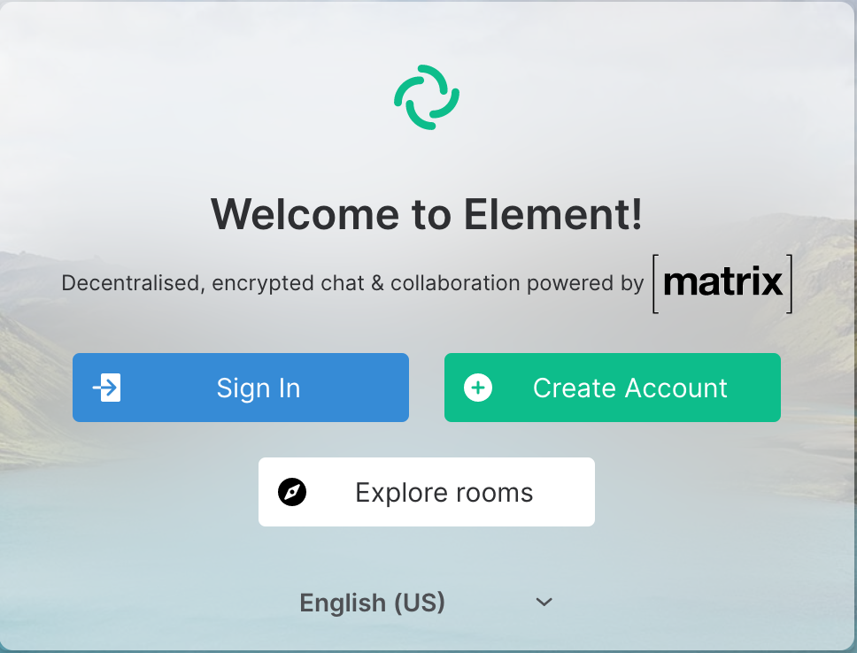
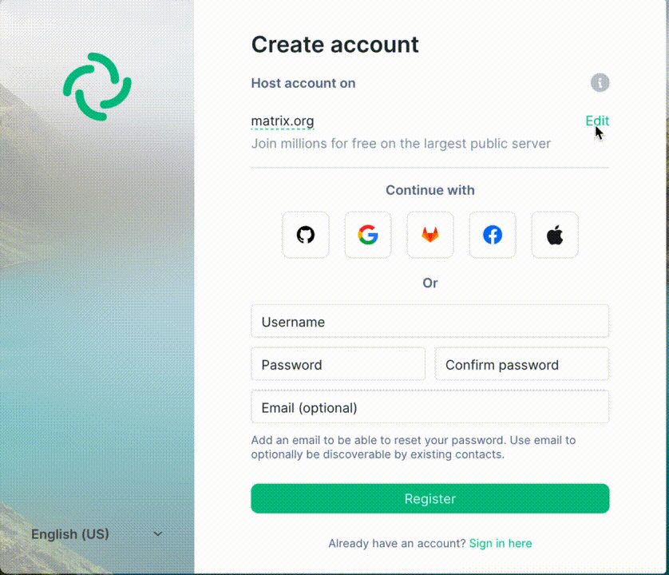
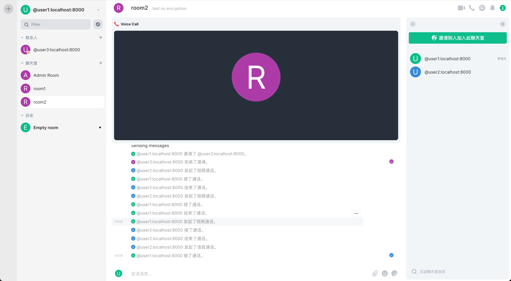

# Social network app

A collection of easily-built social network apps

This repo shows easy decentralization of social networking apps.

## Real time communication

For real-time communication, there are a lot of frameworks and templates based on which users can build their own servers and client apps to realize voice/video chat, with AR functionalities added. 

### Simple example based on Mozilla Matrix framework

[This page](https://matrix.org/docs/projects/try-matrix-now/) lists common servers and clients under the Matrix framework. The easiest way to start a server and client app to test the functionality is to use [Conduit docker image server](https://gitlab.com/famedly/conduit) with [Element web](https://matrix.org/docs/projects/client/element) client app. 

```diff
+ Basic installation using docker images
```

**Install Conduit docker image**

```docker pull matrixconduit/matrix-conduit:latest```

then 

```docker run -d -p 8448:8000 -v db:/srv/conduit/.local/share/conduit -e ROCKET_SERVER_NAME="localhost:8000" matrixconduit/matrix-conduit:latest```

This will start a server with the base url "http://localhost:8448"

**Install Element Web client app docker image**

```docker run --rm -p 80:80 vectorim/element-web```

Then open in browser "http://localhost:80"

You will see the following page. 



Click on "Create account" then in the following screen change the host server



After changing the server address to **http://localhost:8448**, which has just been started in the installation process of Conduit, you will be able to create users or sign in as an existing user on this domain. The identifier of a user in a certain domain has the form **user_name@domain.address**. So if you create a user called "user1", this user will be identified as "user1@localhost:8000" in the Conduit docker container(Note that the port 8000 of the docker container corresponds to the port 8448 of your machine).

```diff
+ Advanced installation 
```

As mentioned in the Matrix documentation, there are a range of server/client-side parameters that can be configured to enable features or encryptions, etc. 

#### **To test the real time video conferencing**

The following screenshot shows successful voice/video chats after installation and configurations.


